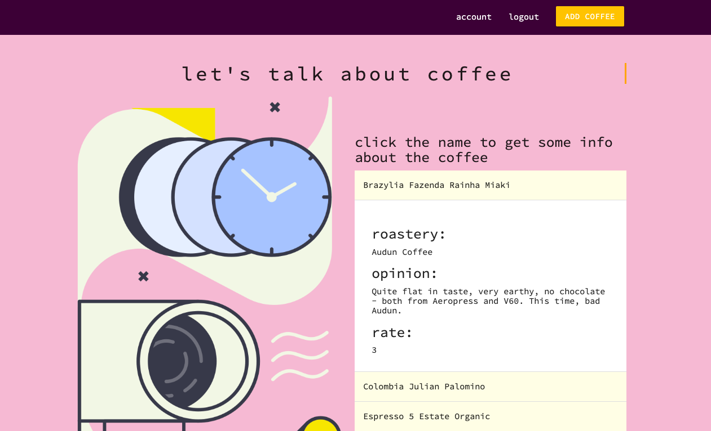

# coffee brands ☕
An app which helps you to find out, which coffee is worth having.

[Website demo](https://agatapst.github.io/coffee_brands/)

## Table of Contents
- General info
- Technologies
- Status
- Additional info

### General info
Project is a simple app for people drinking coffee and enjoy trying different brands, flavors and ways of preparing. Firstly, user has to sign up to create account. Then, it is possible to view the coffee name, roastery, opinion and rate given by some other users. Eveyone can also add new coffee.

### Technologies
- CSS3
- HTML5
- Materialize 1.0.0
- JavaScript / ES6
- Firebase

### Status
The basic version of the project is done. In the future, app will have additional features, such as: in account details section there will be info about the coffee added by particular user.

### Additional info
This app structure is inspired on _Firebase Auth Tutorial by The Net Ninja_, but the whole concept and project layout was designed by me.

Illustration was downloaded from [Icons8](https://icons8.com).
